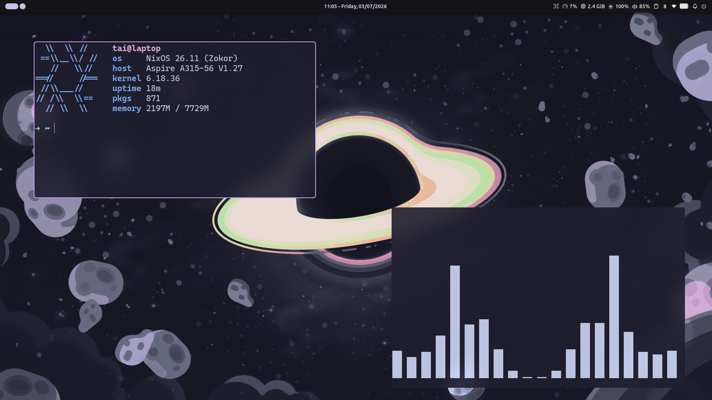

# My NixOS dotfiles

<div align="center">


<br/>



*A fully declarative, reproducible, and minimal Wayland desktop environment managed via Nix Flakes and Home Manager.*

</div>

---

## 📖 Overview

This repository contains my personal NixOS configuration. Built on **Nix Flakes** and **Home Manager**, it provides a cohesive, reproducible computing environment across system packages, kernel modules, hardware daemons, and granular userland configurations.

The desktop is centered around **[Niri](https://github.com/YaLTeR/niri)** — an infinitely scrollable-tiling Wayland compositor — unified by the **[Noctalia](https://github.com/noctalia-dev/noctalia)** desktop shell & greeter, and styled throughout with the **Catppuccin Mocha** palette.

---

## ✨ Key Highlights

- **📜 Scrollable Tiling Workflow**: Effortless horizontal workspace scaling with Niri, featuring fluid animations, dynamic column sizing, and zero window overlap clutter.
- **🎨 Unified Aesthetics**: System-wide Catppuccin Mocha (blue accent) theming applied across GTK, Qt, Ghostty, Neovim, Noctalia Shell, Banana cursor, and custom lockscreen visualizers.
- **⚡ Zero-Boilerplate Module Discovery**: Flake architecture automatically scans and imports all NixOS and Home Manager modules recursively (`scanModules`), eliminating repetitive `default.nix` import lists.
- **🔋 ASUS Hardware & Battery Longevity**:
  - Integrated `asusd` power daemon for automated AC/DC platform profiles.
  - Custom `battery` CLI utility and `.desktop` shortcuts supporting threshold limiting (70% health limit) and travel one-shot charging (100% oneshot mode).
- **🎮 Isolated Gaming Specialisation**: High-performance Steam and Gamescope configuration isolated into a dedicated `gaming` boot specialisation to keep the primary profile lean.
- **⌨️ Keyboard & Input Comfort**:
  - Hardware-level `Caps Lock` ⇄ `Esc` swap managed by `keyd`.
  - Vietnamese input via `fcitx5` integrated seamlessly with Wayland and Neovim.
- **💻 Curated Developer Environment**:
  - **Ghostty** with native Wayland blur and fast GPU acceleration.
  - **Fish Shell** with vi mode, contextual git prompt, `fifc`, and fast CLI navigators (`fzf`, `zoxide`, `yazi`, `eza`, `bat`).
  - **Neovim** configured modularly in Lua (`blink-cmp`, `snacks.nvim`, Treesitter, LSPs, formatters, and snippets).
  - **Google Antigravity IDE** wrapped with Wayland Ozone and IME acceleration.
  - **Hermes Agent** CLI configured declaratively through its upstream Home Manager module (no `hermes config set` — see below).
- **🔐 Encrypted Secrets at Rest**: API keys and tokens managed with [sops-nix](https://github.com/Mic92/sops-nix) + **age**, committed only in ciphertext (`secrets/secrets.yaml`).

---

## 🖥️ Target Machines

| Host | Status | Target Hardware | Purpose |
| :--- | :---: | :--- | :--- |
| **`asus-tuf`** | **Active (Daily Driver)** | ASUS TUF Gaming A15 (FA506NC)<br/>• AMD Ryzen CPU<br/>• NVIDIA GeForce RTX 3050 (`modesetting`, `nvidiaPersistenced`)<br/>• NTFS3 secondary storage (`/mnt/Storage`) | Primary workstation for development, daily productivity, and gaming. |
| **`acer-aspire`** | *Legacy / Backup* | Acer Aspire Laptop | Maintained for flake evaluation compatibility. |

---

## 📦 Software Stack

### Desktop & UI
- **Compositor**: [Niri](https://github.com/YaLTeR/niri) (Scrollable-tiling Wayland compositor)
- **Shell & Panel**: [Noctalia Shell](https://github.com/noctalia-dev/noctalia) (top bar, dock, control center, dynamic lockscreen widgets, wallpaper switcher)
- **Display Manager**: [Noctalia Greeter](https://github.com/noctalia-dev/noctalia) (`greetd`)
- **Theme**: Catppuccin Mocha (Accent: Blue)
- **Cursor**: Banana Cursor (`banana-cursor`)
- **Icons**: Colloid Dark (`colloid-icon-theme`)
- **Fonts**: `CaskaydiaCove Nerd Font`, `JetBrainsMono Nerd Font`, `Ubuntu`, `Noto Fonts`

### Terminal & Shell
- **Terminal Emulator**: [Ghostty](https://ghostty.org/)
- **Shell**: Fish (with Vi keybindings, custom dirty git prompt, `fifc` fzf completions)
- **CLI Utilities**: `eza` (modern ls), `bat` (cat with syntax highlighting), `yazi` (file manager), `zoxide` (smart cd), `fzf`, `ripgrep`, `lazygit`, `btop`, `nix-index`

### Applications & Productivity
- **Development**: Modular Neovim, Antigravity IDE, Opencode, Hermes Agent CLI (declaratively managed)
- **Web Browsers**: [Zen Browser](https://zen-browser.app/) (Beta), [Helium Browser](https://github.com/oxcl/nix-flake-helium-browser)
- **Documents & Media**: Zathura (PDF/EPUB), Loupe (Images), MPV (Audio/Video), LibreOffice
- **Communication & Social**: Vesktop (Discord with Vencord plugins), LocalSend
- **Other Services**: Cloudflare WARP (`cloudflare-warp`), Waydroid, Anki, OBS Studio, qBittorrent

---

## ⌨️ Essential Keybindings

### System & Noctalia Menus
| Shortcut | Action |
| :--- | :--- |
| `Mod + D` | Open Noctalia Application Launcher |
| `Mod + S` | Toggle Noctalia Control Center |
| `Mod + P` | Open Session Menu (Power, Reboot, Logout) |
| `Mod + V` | Open Clipboard History |
| `Mod + ,` | Open Noctalia Settings |
| `Mod + Alt + L` / `Ctrl + Alt + L` | Lock Screen |
| `Mod + Shift + B` | Toggle Battery Limit (70% longevity ⇄ 100% oneshot) |
| `Mod + Shift + /` | Show Niri Hotkey Overlay |

### Applications
| Shortcut | Action |
| :--- | :--- |
| `Mod + Return` | Spawn Ghostty Terminal |
| `Mod + B` | Launch Zen Browser |
| `Mod + E` | Open Nautilus File Explorer |

### Niri Window Management
| Shortcut | Action |
| :--- | :--- |
| `Mod + H` / `Mod + L` | Focus column left / right |
| `Mod + J` / `Mod + K` | Focus window down / up within column |
| `Mod + Shift + H` / `L` | Move column left / right |
| `Mod + Shift + J` / `K` | Move window down / up |
| `Mod + R` | Cycle preset column widths (`50%`, `33.3%`, `66.7%`) |
| `Mod + F` | Maximize column |
| `Mod + Shift + F` | Fullscreen window |
| `Mod + Q` | Close focused window |

*(Note: `Caps Lock` and `Esc` are swapped at hardware level via `keyd` for ergonomic modal editing).*

---

## 🛠️ Custom CLI Utilities (`myScripts.*`)

Packaged as standalone flakes executables with strict runtime dependency sandboxing:

### 1. `battery` — ASUS Battery Health Manager
Manage ASUS battery charge thresholds via `asusctl` with desktop notifications:
```bash
battery status          # Show current charge limit and battery stats
battery 70              # Set limit to 70% (optimal for battery health on AC)
battery oneshot         # One-shot charge to 100% for travel
battery toggle          # Toggle between 70% and 100% oneshot
```

### 2. `note` — Git-Backed Markdown Notes
Effortless note management synced directly with a git repository:
```bash
note                    # Open today's note (YYYYMMDD.md) in Neovim
note <title>            # Open or create a specific note
note new <title>        # Create a new note with optional title
note folder             # Search notes interactively via Neovim Snacks picker
note pull               # Pull updates from remote repository
note push               # Stage all, commit with timestamp, and push
note clone <repo_url>   # Clone (or merge into existing non-empty dir) remote notes
```

### 3. `rcc` — Instant C/C++ Runner
Compile, execute with strict flags, and cleanly remove the generated binary in a single step:
```bash
rcc solution.cpp        # Compiles with g++ -std=c++17 -O2 -Wall -Wextra, runs, and cleans up
rcc main.c              # Compiles with gcc -std=c11 -O2 -Wall -Wextra, runs, and cleans up
```

---

## 🤖 Hermes Agent

The [Hermes Agent](https://github.com/NousResearch/hermes-agent) CLI is managed **declaratively** through the upstream Home Manager module shipped by the `hermes-agent` flake input — `modules/home-manager/programs/hermes.nix` is a thin wrapper that only imports it:

```nix
imports = [ inputs.hermes-agent.homeManagerModules.default ];
```

- The input owns `programs.hermes-agent` (CLI on `PATH` + `HERMES_HOME`) and `services.hermes-agent` (declarative `config.yaml`).
- `services.hermes-agent.settings` is deep-merged into `~/.hermes/config.yaml` on every switch: keys Nix declares win, runtime-written keys (`_config_version`, onboarding state) are preserved.
- Enabling it writes a `~/.hermes/.managed` marker — the CLI then **refuses** `hermes config set|edit` and `hermes setup`, pointing at `home-manager switch`. Edit `hermes.nix`, never the CLI.
- The default model is `deepseek-flash`; since DeepSeek is text-only, `auxiliary.vision` routes image/OCR work to Gemini.
- Built-in memory (`memory.memory_enabled` / `user_profile_enabled`) is declared in `settings` too. It ships on by default but the *Blank Slate* setup preset writes both flags off, so the module pins them on.

## 🔐 Secrets (sops-nix)

Secrets are encrypted at rest with [sops-nix](https://github.com/Mic92/sops-nix) + **age**, stored in `secrets/secrets.yaml` (age key at `~/.config/sops/age/keys.txt`).

- Wired from both sides: `sops-nix.nixosModules.sops` (`hosts/common/core.nix`) and `sops-nix.homeManagerModules.sops` (`hosts/common/home.nix`).
- Consumers declare `sops.secrets."<name>"` guarded by `modules.home.programs.sops.enable`; e.g. the `hermes-env` secret is rendered to `~/.hermes/.env`.
- Never commit plaintext secrets or age keys.

---

## 📂 Repository Structure

```
.dotfiles/
├── flake.nix                # Flake entrypoint (inputs, overlays, outputs)
├── flake.lock               # Pinned input hashes
├── assets/                  # Wallpapers, icons, and screenshot
│   ├── icons/               # Battery and status icons
│   ├── wallpapers/          # Curated wallpapers
│   └── screenshot.png       # Desktop preview
├── config/                  # Standalone application configurations
├── hosts/                   # Machine profiles
├── modules/
│   ├── home-manager/        # User-level modules (auto-discovered)
│   │   ├── app/             # Desktop applications (Ghostty, Zen, Antigravity, etc.)
│   │   ├── desktop/         # Niri and Noctalia Shell / Greeter configuration
│   │   └── programs/        # CLI & user tools (Fish, Neovim, Bat, Eza, Git, Nh, Hermes, Sops)
│   └── nixos/               # System-level modules (auto-discovered)
│       ├── program/         # System programs (Steam, Fcitx5, Waydroid, LocalSend)
│       └── service/         # System services (Keyd, Noctalia Greeter, SDDM)
├── scripts/                 # Custom shell scripts wrapped as flake packages
└── secrets/                 # sops/age-encrypted secrets.yaml
```

---

## 🚀 Getting Started

### Prerequisites
- NixOS installed with **Flakes** and the **`nix-command`** experimental feature enabled.

### 1. Clone Configuration
```bash
git clone https://github.com/taitapcode/.dotfiles.git ~/.dotfiles
cd ~/.dotfiles
```

### 2. Verify Flake Evaluation
Safely verify the flake without making any changes to your running system:
```bash
# Check all flake outputs and module syntax
nix flake check

# Or evaluate the asus-tuf target derivation
nix eval .#nixosConfigurations.asus-tuf.config.system.build.toplevel.drvPath
```

### 3. Deploy System Configuration
This setup integrates [nh](https://github.com/viperML/nh) for simplified NixOS management:
```bash
# Build and switch to the asus-tuf profile
nh os switch -H asus-tuf

# Or using standard nixos-rebuild
sudo nixos-rebuild switch --flake .#asus-tuf
```

### 4. Gaming Boot Specialisation
To boot into the isolated Steam/Gamescope gaming environment:
- Select the **`gaming`** specialisation from the GRUB boot menu upon startup, or activate it dynamically:
```bash
sudo /run/current-system/specialisation/gaming/bin/switch-to-configuration test
```

### 5. Maintenance
```bash
# Update all flake inputs
nix flake update

# Clean up older generations keeping the last 5
nh clean all --keep 5
```
